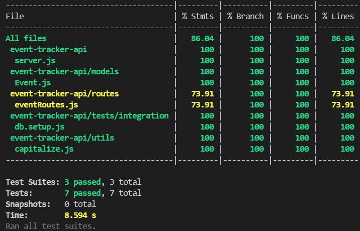

# 📌 Event Tracker API (Keploy Session 2 - Task 1: API Testing)

A backend API server built using Node.js, Express.js, and MongoDB Atlas. It supports full CRUD operations on events.  
This task focuses on writing **unit**, **integration**, and **API tests** to ensure high reliability and code coverage.

---

## 🔧 Tech Stack

- **Node.js**
- **Express.js**
- **MongoDB Atlas**
- **Thunder Client** – manual API testing
- **Jest** – testing framework
- **Supertest** – HTTP assertions
- **Mongoose** – ODM for MongoDB

---


## 📁 Folder Structure

event-tracker-api/
├── models/
│ └── Event.js
├── routes/
│ └── eventRoutes.js
├── tests/
│ ├── unit/
│ │ └── capitalize.test.js
│ ├── integration/
│ │ └── eventModel.test.js
│ └── api/
│ └── eventApi.test.js
├── utils/
│ └── capitalize.js
├── server.js
├── .env
├── .gitignore
├── package.json
└── README.md


---

## 📬 API Endpoints

| Method | Endpoint           | Description         |
|--------|--------------------|---------------------|
| GET    | `/api/events`      | Get all events      |
| POST   | `/api/events`      | Create new event    |
| GET    | `/api/events/:id`  | Get event by ID     |
| PUT    | `/api/events/:id`  | Update event by ID  |
| DELETE | `/api/events/:id`  | Delete event by ID  |

---

## ⚙️ How to Run Locally

1. Clone the repository:
   ```bash
   git clone https://github.com/hansikachaudhary/event-tracker-api.git
   cd event-tracker-api
2. Install dependencies:
   
   npm install
   
3.  Create .env file and add:

    PORT=5000
    MONGO_URI=your_prod_mongodb_uri
    MONGODB_URI_TEST=your_test_mongodb_uri

   
4.   Start the server:
   
       npm start

5.   Run Tests
    
     npm test


   
# 📌 Status
     ✅API server with CRUD routes

     ✅MongoDB Atlas integration

     ✅Thunder Client tested

     ✅GitHub setup with .gitignore & README


🧪 Tests

     | Type          | File                 | Status    |
| ------------- | -------------------- | --------- |
| ✅ Unit Test   | `capitalize.test.js` | ✔️ Passed |
| ✅ Integration | `eventModel.test.js` | ✔️ Passed |
| ✅ API Test    | `eventApi.test.js`   | ✔️ Passed |


Frameworks Used: Jest, Supertest
Test Coverage: 86.04% ✅

## 📸 Coverage Screenshot



## 👩‍💻 Author
  
**Hansika Chaudhary**  
[LinkedIn](https://www.linkedin.com/in/hansika-chaudhary-243164253/)  
[GitHub](hansikachaudhary)

   

